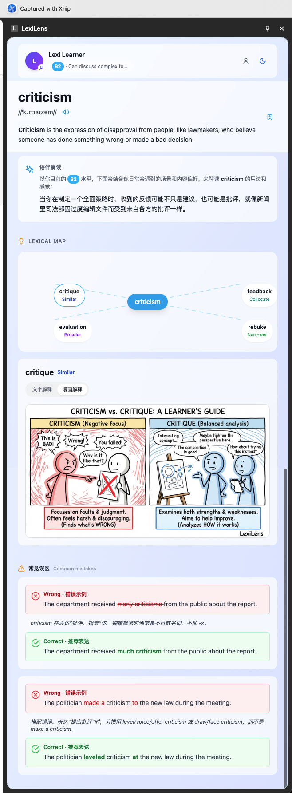
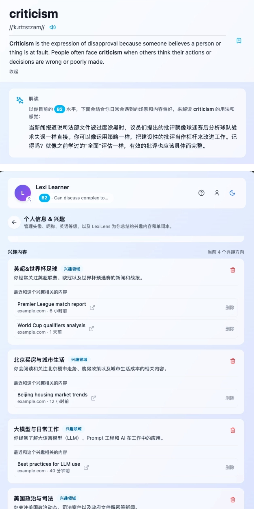
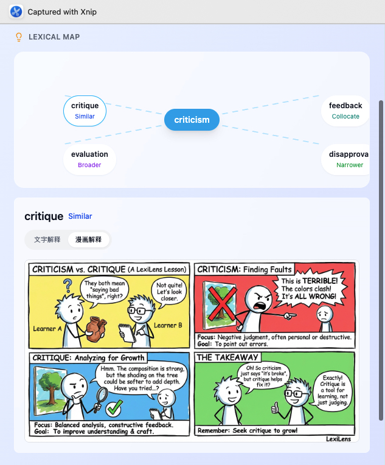
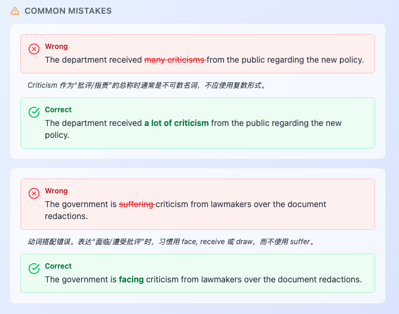

# LexiLens 本地演示（Demo Bundle）

TAL AI HACKATHON 参赛作品  
团队名称：Bazinga  
成员：李想、姬弘飞（外部）

LexiLens 是一个由 Chrome 侧边栏扩展和 FastAPI 后端组成的「即时英语词句语伴」。  
它不是传统查词工具，而是结合用户情况和正在阅读的词句，在浏览器里实时给出分层讲解、常见错误提醒和个性化词本。



---

## 1. 产品概览

LexiLens 以 Chrome 侧边栏形式运行。当你在任意网页中选中一个单词或短语时，它会：

- 根据用户的等级和阅读兴趣，以友好的方式流式输出 Cobuild 风格解释，告诉你这个词在这个语境里到底在干什么（解释而非定义）；
  
  
- 生成近义词、反义词、上下位词，以词汇地图的方式呈现，并提供文本和漫画两种辨析方法；
  

- 提醒学习者常犯的错误以及更地道的表达方式；
  
- 阅读和查询记录自动总结，形成你的兴趣偏好和词汇掌握进度。
  

---

## 2. 功能亮点

- **分层讲解**: Explanation is BETTER THAN definition.
  - Layer 1：词句讲解 —— 用一两句话解释「母语者通常如何在这个句子里使用这个词」；
  - Layer 2：词汇地图 —— 展示相关词、相似词并给出差异对比；
  - Layer 3：常见错误 —— 总结典型中式表达和修改建议；

- **个性化学习**: What you read enlights what you like.
  - 记录你的**查词历史**，后续讲解会引用你已经见过的单词；
  - 自动总结你常看的主题，形成**兴趣标签**，查词的解释深度融合你的兴趣标签完成；
  - 维护一个**个人词本**，保存每次分析的上下文与讲解快照。

- **零摩擦 Chrome 侧边栏体验**: Just 「LexiLens This」!
  - 不跳转页面，只在右侧唤出侧边栏；
  - 通过右键菜单或浮动按钮一键进入；
  - 所有数据都保存在浏览器个人配置和本地后端中（仅限本 Demo）。
  
  

---

## 3. 架构概览

仓库包含两大部分：

- `backend/` —— **FastAPI 后端服务**
  - 暴露 `/api/analyze` 用于流式返回讲解内容；
  - 暴露 `/api/lexical-map/image` 用于生成词汇地图讲解漫画；
  - 配置通过环境变量管理（OpenRouter API Key、模型 ID 等）。

- `extension/` —— **Chrome MV3 扩展**
  - 基于 React、TypeScript、Vite 和 `@crxjs/vite-plugin`；
  - 以 Chrome 侧边栏为主界面；
  - 使用 `chrome.storage.local` 持久化学习历史、兴趣、词本等；
  - 通过 `VITE_API_URL` 访问后端（默认 `http://localhost:8000`）。

---

## 4. 安装与环境准备

### 4.1 运行前置条件

- **Python**：3.11.x
- **Poetry**：1.5+（用于 Python 依赖管理）
- **Node.js**：18.x LTS
- **pnpm**：8.x（推荐的包管理工具）
- **Google Chrome**：最新版稳定版（支持 Manifest V3 与侧边栏）

检查版本示例：

```bash
python3 --version
poetry --version
node --version
pnpm --version
```

### 4.2 后端安装与启动（`backend/`）

在仓库根目录执行：

```bash
cd backend
poetry install
```

创建环境变量文件：

```bash
cp .env.example .env
```

编辑 `.env`，至少配置：

- `OPENROUTER_API_KEY` —— 你的 OpenRouter API Key；
- 其他可选模型设置参考 `backend/README.md`。

启动开发模式后端：

```bash
poetry run uvicorn app.main:app --reload
```

默认会在 `http://localhost:8000` 暴露 API。


### 4.3 扩展安装与构建（`extension/`）

在仓库根目录执行：

```bash
cd extension
pnpm install
```

创建本地环境变量文件：

```bash
cp .env.example .env
```

在 Demo 模式下，`.env` 中建议包含：

```env
VITE_API_URL=http://localhost:8000
VITE_APP_MODE=demo
VITE_ENV=development
```

构建扩展产物：

```bash
pnpm build
```

构建完成后，生产环境扩展会被输出到仓库根目录的 `dist/` 目录（由 Vite/CRX 配置）。

---

## 5. 运行本地 Demo

当后端与扩展都安装完成后：

1. **启动后端**

   ```bash
   cd backend
   poetry run uvicorn app.main:app --reload
   ```

2. **构建 Demo 扩展**

   ```bash
   cd extension
   pnpm build
   ```

3. **在 Chrome 中加载扩展**
   - 打开 `chrome://extensions/`；
   - 打开右上角 **开发者模式 (Developer mode)**；
   - 点击 **「加载已解压的扩展程序（Load unpacked）」**；
   - 选择仓库根目录下生成的 `dist/` 目录。

4. **打开侧边栏开始体验**
   - 打开任意英文网页；
   - 选中一个单词或短语；
   - 通过右键菜单点击 LexiLens This 打开侧边栏；

### 5.1 演示前快速自检

正式 Demo 前建议先跑一遍基础检查：

```bash
# 后端测试与代码风格检查
cd backend
poetry run pytest tests/ -v
poetry run ruff check app/

# 扩展的 Lint 与类型检查
cd ../extension
pnpm lint
pnpm typecheck
```

上述命令全部通过后，本地演示环境基本稳定可用。


